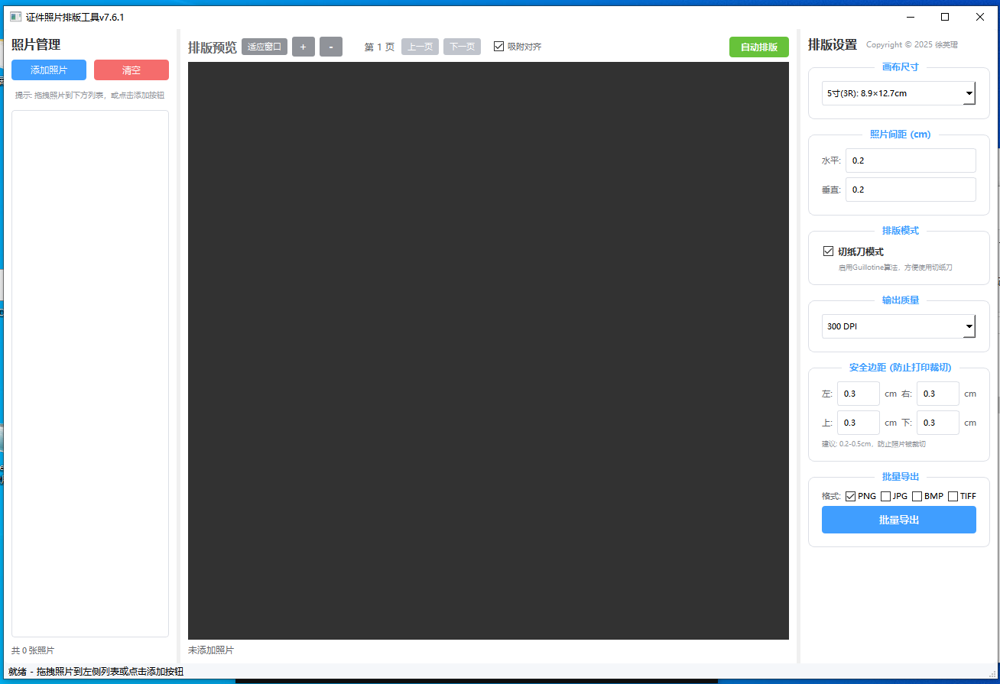

# PhotoPrintLayoutTool - 专业证件照片排版工具

<div align="center">


一款基于 PySide6 开发的专业证件照排版工具，支持多种标准证件照尺寸和自定义尺寸，可自动生成照片排版布局。

</div>

---

## 📖 目录

- [功能特性](#-功能特性)
- [效果预览](#-效果预览)
- [安装说明](#-安装说明)
- [使用方法](#-使用方法)
- [支持的尺寸](#-支持的尺寸)
- [项目结构](#-项目结构)
- [技术栈](#-技术栈)
- [常见问题](#-常见问题)
- [贡献指南](#-贡献指南)
- [许可证](#-许可证)

---

## ✨ 功能特性

- **多种标准尺寸**：内置 1 寸、2 寸、5 寸、签证照片、身份证照片、护照照片等常用证件照尺寸
- **自定义尺寸**：支持用户自定义添加照片尺寸和画布尺寸
- **智能排版**：自动计算最优排版布局，最大化利用相纸空间
- **可视化预览**：实时显示排版效果，所见即所得
- **旋转裁剪**：支持照片旋转和裁剪功能
- **导出打印**：支持导出为图片格式，方便打印
- **配置保存**：自定义尺寸自动保存到配置文件
- **现代化 UI**：简洁美观的用户界面，操作便捷

---

## 📸 效果预览



---

## 📥 安装说明

### 环境要求

- Python 3.8 或更高版本
- PySide6

### 安装步骤

1. **克隆或下载本项目**

```bash
git clone <repository-url>
cd PhotoPrintLayoutTool
```

2. **安装依赖**

```bash
pip install PySide6
```

3. **运行程序**

```bash
python PhotoPrintLayoutTool/7.7/照片排版工具 7.7.2.py
```

---

## 🚀 使用方法

### 基本操作流程

1. **选择照片尺寸**：从下拉菜单中选择所需的证件照尺寸（如 1 寸、2 寸等）
2. **选择画布尺寸**：选择输出相纸的尺寸（如 6 寸、A4 等）
3. **导入照片**：点击"选择照片"按钮，导入需要排版的证件照
4. **调整设置**：可根据需要调整照片方向、边距等参数
5. **生成排版**：点击"生成排版"按钮，自动生成最优布局
6. **导出/打印**：预览满意后，导出图片或直接打印

### 自定义尺寸

如需添加未预设的尺寸：

1. 在相应区域输入自定义名称、宽度和高度（单位：厘米）
2. 点击"添加"按钮保存
3. 新尺寸将出现在下拉菜单中供后续使用

---

## 📏 支持的尺寸

### 默认照片尺寸

| 名称 | 宽度 (cm) | 高度 (cm) |
|------|-----------|-----------|
| 1 寸 | 2.5 | 3.5 |
| 2 寸 | 3.5 | 4.9 |
| 小 1 寸 | 2.2 | 3.2 |
| 大 1 寸 | 3.3 | 4.8 |
| 5 寸 | 8.9 | 12.7 |
| 签证照片 | 3.5 | 4.5 |
| 身份证照片 | 3.5 | 5.3 |
| 护照照片 | 3.5 | 4.5 |

### 默认画布尺寸

| 名称 | 宽度 (cm) | 高度 (cm) |
|------|-----------|-----------|
| 5 寸 (3R) | 8.9 | 12.7 |
| 6 寸 (4R) | 10.2 | 15.2 |
| 7 寸 (5R) | 12.7 | 17.8 |
| A4 | 21.0 | 29.7 |
| A5 | 14.8 | 21.0 |
| A6 | 10.5 | 14.8 |

---

## 📁 项目结构

```
PhotoPrintLayoutTool/
├── PhotoPrintLayoutTool/         # 主程序目录
│   ├── 7.7/                      # 最新版本目录 (v7.7.2)
│   │   └── 照片排版工具 7.7.2.py  # 最新主程序文件
│   ├── 照片排版工具 7/            # v7.x 版本目录
│   ├── 照片排版工具*.py          # 历史版本文件
│   └── photo_layout_config.json  # 配置文件（运行时生成）
├── README.md                     # 项目说明文档
├── LICENSE                       # 开源许可证
└── 文档/
    ├── 主页设计.png              # 界面截图
    └── 安装与使用文档.docx        # 详细使用文档
```

---

## 🛠️ 技术栈

- **编程语言**: Python 3.8+
- **GUI 框架**: PySide6 (Qt for Python)
- **图像处理**: PySide6.QtGui (QImage, QPixmap, QPainter)
- **数据存储**: JSON 配置文件

---

## ❓ 常见问题

### Q: 程序无法启动？
**A**: 请确保已正确安装 PySide6，可使用 `pip install PySide6` 安装。

### Q: 如何修改默认尺寸？
**A**: 可在程序中通过自定义尺寸功能添加，或直接编辑 `photo_layout_config.json` 配置文件。

### Q: 导出的图片清晰度不够？
**A**: 请确保原始照片分辨率足够高，建议不低于 300 DPI。

### Q: 配置文件保存在哪里？
**A**: 配置文件 `photo_layout_config.json` 保存在程序运行目录下。

---

## 🤝 贡献指南

欢迎提交 Issue 和 Pull Request！

1. Fork 本仓库
2. 创建你的特性分支 (`git checkout -b feature/AmazingFeature`)
3. 提交你的修改 (`git commit -m 'Add some AmazingFeature'`)
4. 推送到分支 (`git push origin feature/AmazingFeature`)
5. 开启一个 Pull Request

---

## 📄 许可证

本项目采用 MIT 许可证 - 查看 [LICENSE](LICENSE) 文件了解详情。

---

## 📞 联系方式

如有问题或建议，请通过以下方式联系：

- 提交 Issue
- 发送邮件至项目维护者

---

<div align="center">

**如果觉得有用，请给个 ⭐ Star 支持一下！**

</div>
